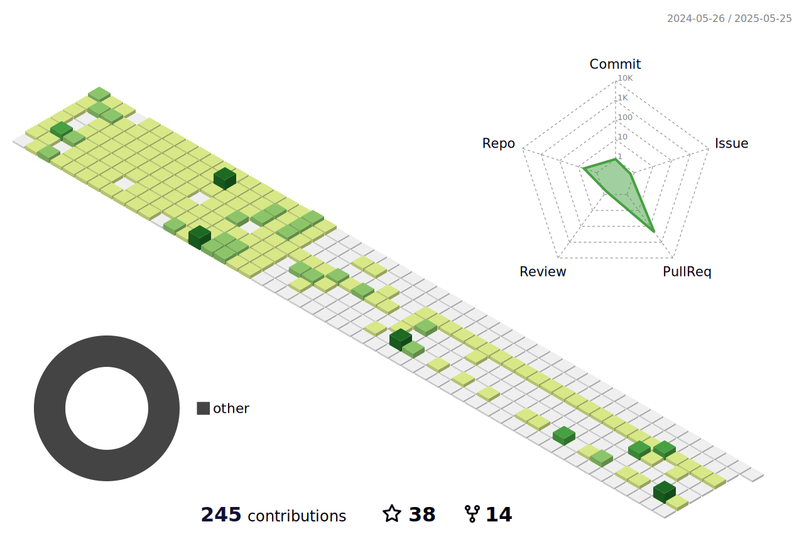

<!--   my-icons -->

    
    
    
    
       

<!--   my-header-img -->

<!--   my-ticker -->    

<!--   my-skils -->

| Property              | Data                                                                                                                                                                                                                                                                                                                                                                                                                                                                                                                                                                                                                                                                                                                                                                                                                                                                                                                                                                                                                                                                                                                                                                                                                                                                                                                                                                                                                                                                                                                                  |
|-----------------------|---------------------------------------------------------------------------------------------------------------------------------------------------------------------------------------------------------------------------------------------------------------------------------------------------------------------------------------------------------------------------------------------------------------------------------------------------------------------------------------------------------------------------------------------------------------------------------------------------------------------------------------------------------------------------------------------------------------------------------------------------------------------------------------------------------------------------------------------------------------------------------------------------------------------------------------------------------------------------------------------------------------------------------------------------------------------------------------------------------------------------------------------------------------------------------------------------------------------------------------------------------------------------------------------------------------------------------------------------------------------------------------------------------------------------------------------------------------------------------------------------------------------------------------|
| **Language / IDE**    |                                                                                                                                                                                                                                                                                                                                                                                                                                                                                                                                                                                                                                                                                                                                                                                                                                                                                                                                                                                                                                                                                                                                                                                                                             |
| **Domain Knownledge** |                                                                                                                                                                                                                                                                                                                                                                                                                                                                                                                                                                                                                                                                                                                                                                                                                                                                                                                                                             |
| **CI / CD**           |                                                                                                                                                                                                                                                                                                                                                                                                                                                                                                                                                                                                                                                                                                                                                                                                                                                                                                                                                                                                                                                                                                                |
| **Databases**         |                                                                                                                                                                                                                                                                                                                                                                                                                                                                                                                                                                                                                                                                       |
| **OS**                |   |
| **Tools & Platform**  |                                                                                                                                                                                                                                                                                                                                                                                                                                                                                                                                                                                                                                                                                                                                                                                                                                                                                                                                                                                                                                                                                                                                                                                                                                             |

<!--   GitHub stats graph -->

### 📈 GitHub Activity Graph:

| .                                                                                                                                             | .                                                                                                                              |
|-----------------------------------------------------------------------------------------------------------------------------------------------|--------------------------------------------------------------------------------------------------------------------------------|
|  |  |

</img>

<!--   profile-green-animate -->

<!--   grid-snake -->

<!--   skyline -->
**Click 👇**

[//]: # (<!--  2d history skills -->)

[//]: # (</img>)

<!--START_SECTION:waka-->
<!--END_SECTION:waka-->

**📫 How to Reach me:**

:trophy: Github Profile Trophy

 

#### Thanks for visiting :heart:

 
  

counting of visitors to this page in this section started from May 8, 2022

### Profile Views

counting of visitors to this page in this section started from June 12, 2022

 

---
*If you liked my profile, you can Star ⭐ the repo and if you want to use this template you can Fork it and can use.*
---
Would you like to meet me?

If you want to contribute to any of my repositories, feel free to submit PRs, issues and email me. Pick a slot if you'd
like to meet me and chat about proposals and ideas - but make sure to describe the agenda

